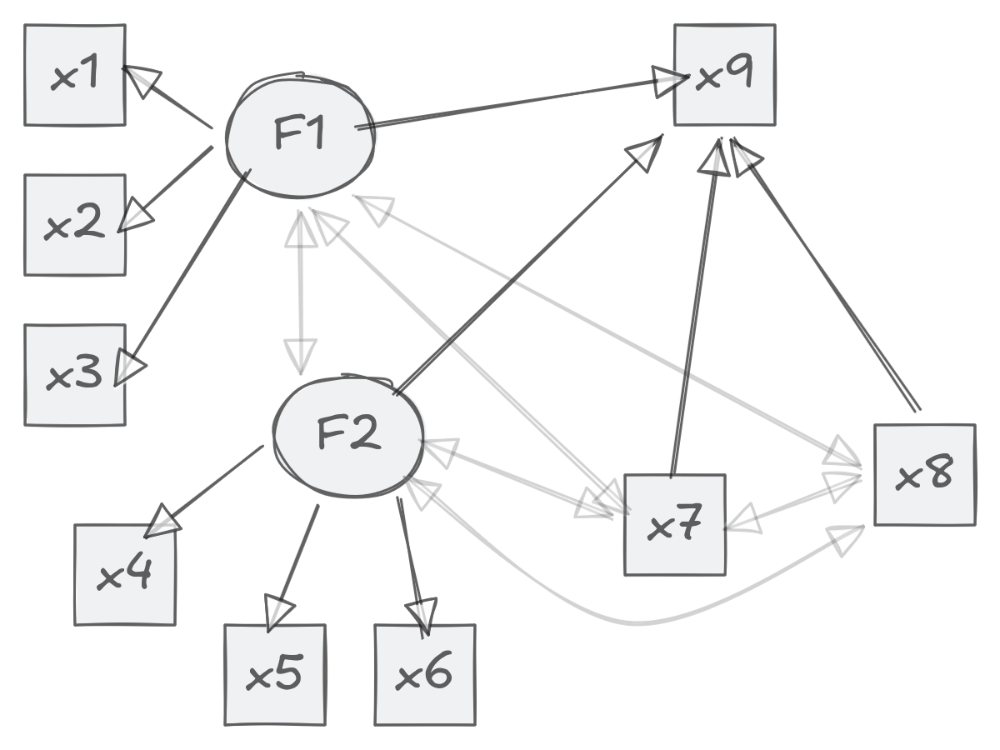

# rccme

The goal of rccme is to produce regression calibrated scores for
downstream regression models.

## Installation

You can install the latest version of rccme with:

``` r
install.packages(
  'rccme',
  repos = c(
    'https://jamesuanhoro.r-universe.dev',
    'https://cloud.r-project.org'
  )
)
```

## Example

We show how to approach the model below:



``` r
library(rccme)

library(lavaan) # for data source and measurement models
```

``` R
## This is lavaan 0.6-21
## lavaan is FREE software! Please report any bugs.
```

``` r
dat <- HolzingerSwineford1939[, paste0("x", 1:9)]

sem_fit <- sem(
  paste(
    "F1 =~ x1 + x2 + x3",
    "F2 =~ x4 + x5 + x6",
    "x9 ~ F1 + F2 + x7 + x8",
    "F1 + F2 ~~ x7 + x8",
    sep = "\n"
  ),
  dat,
  std.lv = TRUE
)

# two-step using factor analysis ----
cfa_f1 <- cfa("F1 =~ x1 + x2 + x3", dat, std.lv = TRUE)
cfa_f2 <- cfa("F2 =~ x4 + x5 + x6", dat, std.lv = TRUE)
score_f1 <- lavaan::lavPredict(cfa_f1, se = "standard")
score_f2 <- lavaan::lavPredict(cfa_f2, se = "standard")
se_f1 <- unname(attr(score_f1, "se")[[1]][, 1, drop = TRUE])
se_f2 <- unname(attr(score_f2, "se")[[1]][, 1, drop = TRUE])

# save factor scores
dat$f1 <- score_f1
dat$f2 <- score_f2

# calibrate factor scores
rc_fs <- rccme_calib_me(
  dat[, c("f1", "f2")],
  w_se_vec = c(se_f1, se_f2), z_mat = dat[, c("x7", "x8")]
)

# save calibrated factor scores
dat$f1_rc <- rc_fs[, 1]
dat$f2_rc <- rc_fs[, 2]

# two-step using sum-score ----
# compute standardised sum scores
dat$std_1 <- scale(rowMeans(dat[, c("x1", "x2", "x3")]))
dat$std_2 <- scale(rowMeans(dat[, c("x4", "x5", "x6")]))
# compute coefficient alpha
rel_1 <- psych::alpha(dat[, c("x1", "x2", "x3")])$total$raw_alpha
```

``` R
## Warning in response.frequencies(x, max = max): response.frequency has been
## deprecated and replaced with responseFrequecy.  Please fix your call

## Number of categories should be increased  in order to count frequencies.
```

``` r
rel_2 <- psych::alpha(dat[, c("x4", "x5", "x6")])$total$raw_alpha
```

``` R
## Warning in response.frequencies(x, max = max): response.frequency has been
## deprecated and replaced with responseFrequecy.  Please fix your call

## Number of categories should be increased  in order to count frequencies.
```

``` r
# calibrate sum scores
rc_ss <- rccme_calib_me(
  dat[, c("std_1", "std_2")],
  # Add `standard = TRUE` for standardised sum scores
  rel_vec = c(rel_1, rel_2), z_mat = dat[, c("x7", "x8")], standard = TRUE
)

# save calibrated sum scores
dat$std_1_rc <- rc_ss[, 1]
dat$std_2_rc <- rc_ss[, 2]

# model results ----
# sum-score without measurement error correction
fit_ss <- lm(x9 ~ std_1 + std_2 + x7 + x8, dat)
# sum-score without measurement error correction
fit_ss_rc <- lm(x9 ~ std_1_rc + std_2_rc + x7 + x8, dat)
# with standard factor scores
fit_fs <- lm(x9 ~ f1 + f2 + x7 + x8, dat)
# with calibrated factor scores
fit_fs_rc <- lm(x9 ~ f1_rc + f2_rc + x7 + x8, dat)

# SEM results
sem_fit |>
  parameterestimates() |>
  subset(op == "~")
```

``` R
##    lhs op rhs    est    se      z pvalue ci.lower ci.upper
## 7   x9  ~  F1  0.464 0.078  5.945  0.000    0.311    0.616
## 8   x9  ~  F2 -0.018 0.065 -0.285  0.776   -0.145    0.108
## 9   x9  ~  x7  0.191 0.046  4.138  0.000    0.101    0.282
## 10  x9  ~  x8  0.219 0.054  4.061  0.000    0.113    0.324
```

``` r
# Comparing the methods
modelsummary::modelsummary(
  list(
    "Sum score" = fit_ss,
    "Factor scores" = fit_fs,
    "Calibrated sum scores" = fit_ss_rc,
    "Calibrated factor scores" = fit_fs_rc
  ),
  coef_map = c(
    "std_1" = "F1", "std_2" = "F2",
    "std_1_rc" = "F1", "std_2_rc" = "F2",
    "f1" = "F1", "f2" = "F2",
    "f1_rc" = "F1", "f2_rc" = "F2",
    "x7" = "x7", "x8" = "x8"
  ),
  output = "markdown", gof_omit = "IC|R2|Log|F|RMSE|Obs"
)
```

|     | Sum score | Factor scores | Calibrated sum scores | Calibrated factor scores |
|-----|-----------|---------------|-----------------------|--------------------------|
| F1  | 0.321     | 0.395         | 0.450                 | 0.427                    |
|     | (0.052)   | (0.063)       | (0.074)               | (0.070)                  |
| F2  | 0.074     | 0.085         | -0.000                | 0.025                    |
|     | (0.051)   | (0.054)       | (0.061)               | (0.058)                  |
| x7  | 0.173     | 0.164         | 0.203                 | 0.184                    |
|     | (0.051)   | (0.051)       | (0.052)               | (0.051)                  |
| x8  | 0.277     | 0.277         | 0.217                 | 0.228                    |
|     | (0.056)   | (0.056)       | (0.059)               | (0.058)                  |
